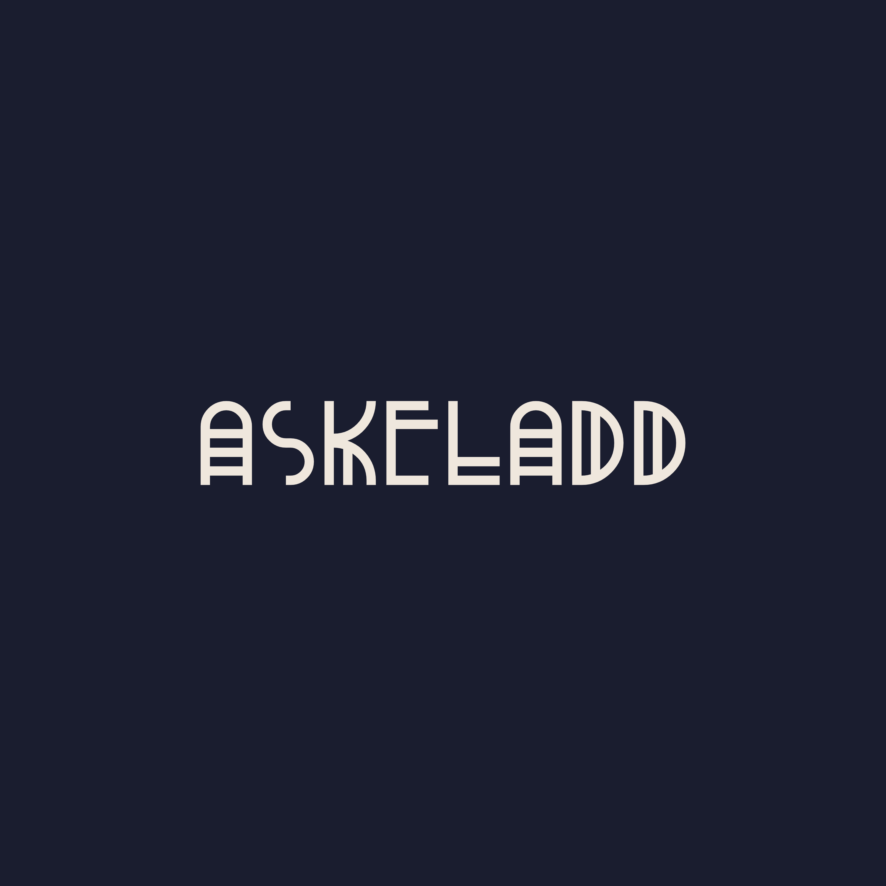
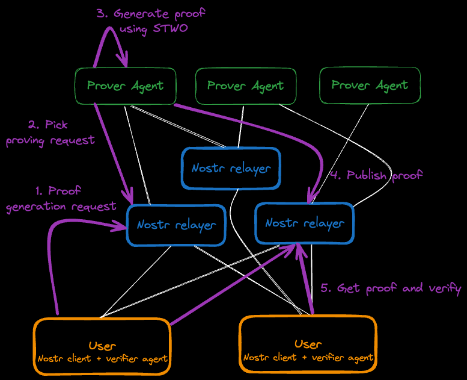

<div align="center">
    
    <h2>Censorship-resistant global proving network.</h2>

<a href="https://github.com/AbdelStark/askeladd/actions/workflows/ci.yaml"></a>
<!--a href="https://github.com/AbdelStark/askeladd/actions/workflows/e2e-test.yaml"></a-->
<a href="https://bitcoin.org/"> </a>
<a href="https://nostr.com/"> </a>
<a href="https://lightning.network/"></a>
<a href="https://www.rust-lang.org/"> </a>

</div>

## About

Askeladd is a censorship-resistant global proving network, for anyone to be able to generate validity proofs, using [STWO](https://github.com/starkware-libs/stwo) prover, and verify them. It enables to submit proving request to the network and retrieve the generated proof for any given request.
Askeladd leverages [Nostr](https://github.com/nostr-protocol/nostr) for the communication layer, to gossip the proving requests and generated proofs.

As Zero-Knowledge-Proof technology keeps evolving rapidly, it's clear that there will be a need for decentralised infrastructure to be able to generate and verify proofs in a censorship-resistant way. Not everythng has to live on blockchain, and Askeladd is here to help, leveraging the simplicity of Nostr.

> **Disclaimer:** Askeladd is only a proof of concept and should not be used in a production environment. It's a work in progress as a showcase of the STWO prover and the Nostr protocol.

Check out this video demonstration of Askeladd in action:

[](https://asciinema.org/a/668441)

## Architecture



Typical flow:

1. User submits a proving request to the network
2. An Askeladd prover agent generates a proof for the request
3. The proof is published to the Nostr network
4. The user can verify the proof using the Askeladd verifier agent

## Open questions / TODOs

- [ ] Use [NIP-90 - Data Vending Machine](https://nips.nostr.com/90) to define interaction between Service Providers (prover agents) and customers (users needing to generate proofs).
  - Check <https://vendata.io/dvms> mechanism to see how it works.
- [ ] Use [NIP-89 -Recommended Application Handlers](https://nips.nostr.com/89) for prover agents to advertise their support for certain types of proving requests, their pricing model, etc.
- [ ] Use [NIP-57 - Lightning Zaps](https://nips.nostr.com/57) to handle the payment for the proofs.
- [ ] Use [NIP-13 - Proof of Work](https://nips.nostr.com/13) for spam protection.
- [ ] Use [NIP-94 - File Metadata](https://nips.nostr.com/94) and/or [NIP-96 - HTTP File Storage Integration](https://nips.nostr.com/96) to handle transport of the proofs and metadata over the network.

## Running the demo

### Using docker-compose

```bash
./run_demo.sh
```

### Manually

Create a `.env` file, you can use the `.env.example` file as a reference.

```bash
cp .env.example .env
```

In terminal 1, run the nostr relay:

```bash
docker run -p 8080:8080 scsibug/nostr-rs-relay
```

In terminal 2, run the prover agent:

```bash
cargo run --bin prover_agent
```

In terminal 3, run the user CLI:

```bash
cargo run --bin user_cli
```

The user CLI binary will submit a proving request to the Nostr network. The prover agent will generate a proof for the request and publish it to the Nostr network. The user CLI binary will be able to verify the proof.

## 🤝 Contributing

We love contributions! If you have ideas for improvements or find any issues, please open an issue or submit a pull request.

## 📜 License

This project is licensed under the MIT License - see the [LICENSE](LICENSE) file for details.

## 🙏 Acknowledgements

This demo is powered by the amazing [STWO Prover](https://github.com/starkware-libs/stwo) from StarkWare. A big thank you to the StarkWare team and all contributors!

## 📚 Resources

- [Nostr Rust relay](https://github.com/scsibug/nostr-rs-relay/)
- [Nostr web tooling](https://nostrtool.com/)
