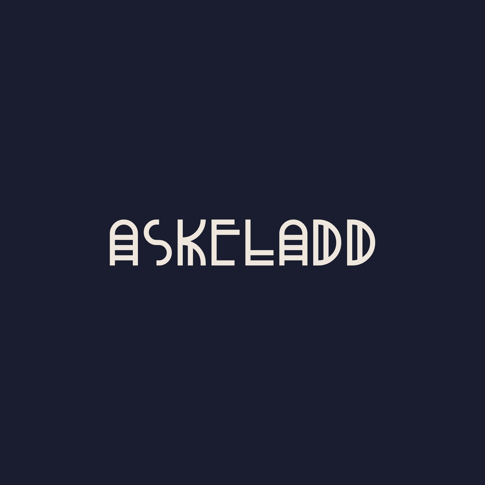
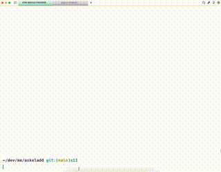
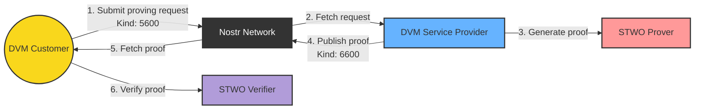

<div align="center">
    
    <h2>Censorship-resistant, globally verifiable proving network.</h2>
    <p><strong>Don't trust. Verify.</strong> STARK proofs for Nostr Data Vending Machines.</p>

<a href="https://github.com/AbdelStark/askeladd/actions/workflows/ci.yaml"></a>
<a href="LICENSE"></a>
<a href="https://nips.nostr.com/90"></a>
<a href="https://bitcoin.org/"></a>
<a href="https://nostr.com/"></a>
<a href="https://www.rust-lang.org/"></a>

</div>

---

> *"Cryptography shifts the balance of power from those with a monopoly on violence to those who comprehend mathematics and security design."* — Jacob Appelbaum

## Why this exists

[Nostr](https://github.com/nostr-protocol/nostr) is rebuilding the internet on open, permissionless rails. [Data Vending Machines](https://nips.nostr.com/90) (DVMs, NIP-90) turn it into a **free market for computation**: broadcast a job, attach a Lightning micropayment, and machines around the world compete to execute it. No accounts, no gatekeepers, no platform risk.

But a market where anyone can sell computation has a problem: **why should you believe the answer?**

Askeladd's answer is the only one worth having: don't trust — verify. Every job result comes back with a **STARK proof** of correct execution, generated with StarkWare's [STWO](https://github.com/starkware-libs/stwo) prover ([Circle STARKs](https://eprint.iacr.org/2024/278)). The customer verifies the proof locally, in the browser if needed, and gains *mathematical certainty* that the computation was performed correctly — without redoing it, and without trusting the machine that did it.

This is the missing layer of the Nostr economy, and it matters more every day. As AI agents start hiring other machines to compute for them, a receipt is not enough — they need a proof. Sovereign, open-source, unstoppable AI needs **verifiable computation** the same way free speech needed Nostr and free money needed Bitcoin. Askeladd is a step toward that world: the **Integrity Web**, where trust is replaced by mathematics.

Read the full thesis: [Powering Verifiable Computation for the Nostr Revolution](https://hackmd.io/@AbdelStark/nostr-dvm-verifiable-computation) and the worldview behind it: [A Freedom Tech Manifesto](https://www.fgu.tech/).

## What it is

Askeladd is a working proof of concept of a verifiable DVM:

1. A **customer** submits a proving job to the Nostr network (NIP-90 job request, kind `5600`).
2. A **service provider** — the prover agent — picks it up, runs the computation, and generates a STARK proof with STWO.
3. The result and the proof are published back to Nostr (job result, kind `6600`).
4. The customer **verifies the proof** — natively in Rust, or in the browser through WebAssembly.

Built-in provable programs (STWO reference AIRs): **Fibonacci**, **Multi-Fibonacci**, **Wide Fibonacci** (SIMD), and **Poseidon** hashing. They are deliberately simple — the point is the pattern, and the pattern generalizes to any computation you can express as a STARK.

> [!IMPORTANT]
> **Status: proof of concept, built for education.** Askeladd demonstrates the architecture end to end, but it is not audited, has no payment enforcement, and must not be trusted with production workloads. Read the code, run the demo, steal the ideas.

Watch it work:

[](https://asciinema.org/a/670103)



## How it works


```mermaid
graph LR
    Customer((DVM Customer))
    SP[DVM Service Provider]
    Nostr[Nostr Network]
    STWO_P[STWO Prover]
    STWO_V[STWO Verifier]

    Customer -->|1. Submit proving request<br>Kind: 5600| Nostr
    Nostr -->|2. Fetch request| SP
    SP -->|3. Generate proof| STWO_P
    SP -->|4. Publish proof<br>Kind: 6600| Nostr
    Nostr -->|5. Fetch proof| Customer
    Customer -->|6. Verify proof| STWO_V

    classDef customer fill:#f9d71c,stroke:#333,stroke-width:2px;
    classDef provider fill:#66b3ff,stroke:#333,stroke-width:2px;
    classDef network fill:#333,stroke:#333,stroke-width:2px,color:#fff;
    classDef prover fill:#ff9999,stroke:#333,stroke-width:2px;
    classDef verifier fill:#b19cd9,stroke:#333,stroke-width:2px;

    class Customer customer;
    class SP provider;
    class Nostr network;
    class STWO_P prover;
    class STWO_V verifier;
```

Every piece of the exchange is a plain Nostr event — the network is the message bus, the job board, and the proof distribution layer in one. Proofs are self-contained: anyone who sees the result event can verify it, not just the original customer.

| Event kind | Role |
| ---------- | ---- |
| `5600` | Job request: program selector + inputs (NIP-90 range) |
| `6600` | Job result: output + serialized STARK proof |
| `5700` | Program launch (experimental, see [roadmap](#roadmap)) |

Deep dive: [docs/architecture.md](docs/architecture.md) · [docs/protocol.md](docs/protocol.md) · [docs/vision.md](docs/vision.md)

## Quickstart

Prerequisites: [Rust](https://rustup.rs/) (the repo pins a toolchain via `rust-toolchain.toml`), and optionally Docker for the local relay.

### One-command demo (Docker)

Spins up a local Nostr relay, a prover agent, and a customer:

```bash
./scripts/demo_docker_compose_local_relayer.sh
```

### Manual

```bash
cp .env.example .env   # then edit APP_SUBSCRIBED_RELAYS
```

Point `APP_SUBSCRIBED_RELAYS` at a local relay (`ws://localhost:8080`, run one with `docker run -p 8080:8080 scsibug/nostr-rs-relay`) or a public one (`wss://relay.damus.io`). Then, in two terminals:

```bash
# Terminal 1 — the prover agent (DVM service provider)
cargo run --bin dvm_service_provider

# Terminal 2 — the customer: the classic two-job demo
cargo run --bin dvm_customer -- demo
```

The customer CLI can also drive each program individually:

```bash
cargo run --bin dvm_customer -- fibonacci --log-size 5 --claim 443693538
cargo run --bin dvm_customer -- poseidon --log-n-instances 9
cargo run --bin dvm_customer -- wide-fibonacci --log-fibonacci-size 8 --log-n-instances 8
cargo run --bin dvm_customer -- multi-fibonacci --log-sizes 5,5 --claims 443693538,443693538
```

Each command submits a proving job to the network, waits for the prover's result, and verifies the STARK proof locally. The tmux script `./scripts/demo.sh` runs the same flow in a split terminal (requires release binaries: `cargo build --release`).

Configuration lives in `config/default.toml` and can be overridden per environment (`config/{RUN_MODE}.toml`, `config/local.toml`) or via `APP_*` environment variables. See [docs/architecture.md](docs/architecture.md#configuration).

## In the browser

The [`stwo_wasm`](crates/stwo_wasm) crate compiles the prover and verifier to WebAssembly, which powers two frontends:

- **[Askeladd DVM Marketplace](askeladd-dvm-marketplace/)** — a Next.js web app to publish and verify proving jobs through Nostr, with in-browser STARK verification. The WASM bindings are prebuilt and committed under `src/pkg/`, so it runs out of the box. ([demo video](docs/demo/askeladd-dvm-marketplace-demo.mp4))
- **[Thorfinn](thorfinn/)** — a browser extension for generating and verifying STARK proofs over Nostr.

To rebuild the WASM bindings after changing the Rust prover code: `cd crates/stwo_wasm && wasm-pack build --target web`, then copy the generated `pkg/` directory into `askeladd-dvm-marketplace/src/`.

## Repository layout

```
crates/
  core/        askeladd — DVM customer & service provider, Nostr plumbing, SQLite job ledger
  cli/         dvm_customer & dvm_service_provider binaries
  stwo_wasm/   STWO prover/verifier exposed to Rust and WebAssembly (Fibonacci, Poseidon, ...)
askeladd-dvm-marketplace/   Next.js web marketplace
thorfinn/                   Browser extension
config/        Layered configuration (TOML + env)
scripts/       Demo, lint, and formatting scripts
docs/          Vision, architecture, and protocol documentation
```

## Roadmap

- [x] End-to-end verifiable DVM flow over Nostr (NIP-90 kinds 5600/6600)
- [x] STWO proofs for Fibonacci, Multi-Fibonacci, Wide Fibonacci, and Poseidon
- [x] In-browser proving and verification via WebAssembly
- [ ] Lightning payments wired into the job lifecycle (NIP-57 zaps)
- [ ] Large-proof distribution: chunked events or out-of-band proofs (NIP-94 / Blossom / IPFS) so Poseidon-class results fit any relay
- [ ] Pluggable programs: WASM modules fetched from Nostr (NIP-94/96) or IPFS
- [ ] Reputation and discovery for provers (NIP-89 announcements)
- [ ] Verifiable AI inference as a first-class job type

## The name

Askeladd is the cunning hero of Norwegian folklore — the underdog who wins not by force but by wit. (Fans of *Vinland Saga* will recognize both him and [Thorfinn](thorfinn/).) Fitting for a project whose whole thesis is that mathematics outsmarts power.

## Contributing

Contributions are welcome — code, docs, ideas, and new provable programs. Read [CONTRIBUTING.md](CONTRIBUTING.md) to get started, and open an issue to discuss anything bigger.

If you build freedom tech, you're already one of us. Write code as if your future depends on it.

## Security

Askeladd is a proof of concept and has not been audited. See [SECURITY.md](SECURITY.md) for how to report vulnerabilities.

## License

[MIT](LICENSE) — the code is free, forever, for everyone.

## Acknowledgements

- [STWO](https://github.com/starkware-libs/stwo) — the blazing-fast Circle STARK prover this demo is built on, from StarkWare and its contributors.
- [rust-nostr](https://github.com/rust-nostr/nostr) — the Nostr SDK used for all network communication.
- The cypherpunks — who wrote code so the rest of us could write more of it.

## Resources

- Thesis: [Powering Verifiable Computation for the Nostr Revolution](https://hackmd.io/@AbdelStark/nostr-dvm-verifiable-computation)
- Worldview: [A Freedom Tech Manifesto](https://www.fgu.tech/)
- [NIP-90 — Data Vending Machine](https://nips.nostr.com/90) · [NIP-57 — Zaps](https://nips.nostr.com/57)
- [Circle STARKs (paper)](https://eprint.iacr.org/2024/278) · [STWO prover](https://github.com/starkware-libs/stwo)
- [Data Vending Machines](https://www.data-vending-machines.org/) · [Vendata.io](https://vendata.io/dvms)
- [Nostr web tooling](https://nostrtool.com/) · [nostr-rs-relay](https://github.com/scsibug/nostr-rs-relay/)
