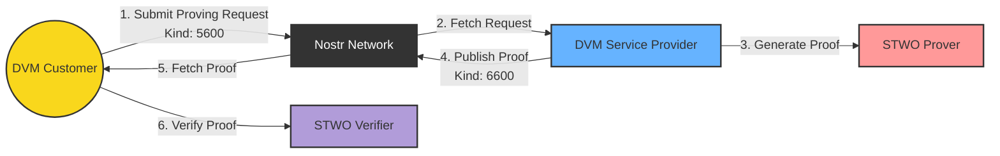

<div align="center">
    
    <h2>Censorship-resistant global proving network.</h2>

<a href="https://github.com/AbdelStark/askeladd/actions/workflows/ci.yaml"></a>

<!--a href="https://github.com/AbdelStark/askeladd/actions/workflows/e2e-test.yaml"></a-->

<a href="https://bitcoin.org/"> </a>
<a href="https://nostr.com/"> </a>
<a href="https://lightning.network/"></a>
<a href="https://www.rust-lang.org/"> </a>

</div>

## About

Askeladd is a censorship-resistant global proving network, for anyone to be able to generate validity proofs, using [STWO](https://github.com/starkware-libs/stwo) prover, and verify them. It enables to submit proving request to the network and retrieve the generated proof for any given request.
Askeladd leverages [Nostr](https://github.com/nostr-protocol/nostr) for the communication layer, to gossip the proving requests and generated proofs, following the [NIP-90 - Data Vending Machine](https://nips.nostr.com/90) specification.

> **Disclaimer:** Askeladd is only a proof of concept and should not be used in a production environment. It's a work in progress as a showcase of the STWO prover and the Nostr protocol.

Check out this video demonstration of Askeladd in action:

[](https://asciinema.org/a/670103)

## Architecture



Typical flow:

1. User submits a proving request to the network (DVM Job Kind `5600`)
2. A DVM Service Provider picks the request and generates a proof using the STWO prover.
3. The proof is published to the Nostr network (DVM Job Result Kind `6600`).
4. The DVM Customer can verify the proof using the STWO verifier.

## Running the demo

### Using docker-compose

```bash
./scripts/demo_docker_compose_local_relayer.sh
```

### Manually

Create a `.env` file, you can use the `.env.example` file as a reference.

```bash
cp .env.example .env

# Set the relay URL in the .env file

# Using a local relay
APP_SUBSCRIBED_RELAYS=ws://localhost:8080

# Or a public relay
APP_SUBSCRIBED_RELAYS=wss://relay.nostr.net
```

(Optional, if you want to run a local nostr relay) In a terminal, run the local nostr relay:

```bash
docker run -p 8080:8080 scsibug/nostr-rs-relay
```

In a terminal, run the prover agent:

```bash
cargo run --bin dvm_service_provider
```

In a terminal, run the user CLI:

```bash
cargo run --bin dvm_customer
```

The user CLI binary will submit a proving request to the Nostr network. The prover agent will generate a proof for the request and publish it to the Nostr network. The user CLI binary will be able to verify the proof.

## 🤝 Contributing

We love contributions! If you have ideas for improvements or find any issues, please open an issue or submit a pull request.

## 📜 License

This project is licensed under the MIT License - see the [LICENSE](LICENSE) file for details.

## 🙏 Acknowledgements

This demo is powered by the amazing [STWO Prover](https://github.com/starkware-libs/stwo) from StarkWare. A big thank you to the StarkWare team and all contributors!

## 📚 Resources

- [Nostr Rust relay](https://github.com/scsibug/nostr-rs-relay/)
- [Nostr web tooling](https://nostrtool.com/)
- [NIP-90 - Data Vending Machine](https://nips.nostr.com/90)
- [Vendata.io](https://vendata.io/dvms)
- [Data Vending Machines](https://www.data-vending-machines.org/)
