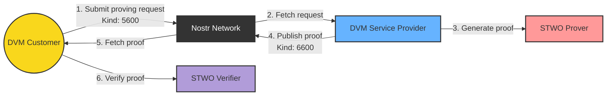

# Architecture

Askeladd is a Rust workspace with three crates plus two JavaScript frontends. The design goal is the smallest possible system that demonstrates verifiable computation over Nostr end to end — and that you can read in an afternoon.

## Crates

### `crates/core` — the `askeladd` library

All logic lives here; the binaries are thin shells over it.

| Module | Responsibility |
| ------ | -------------- |
| `config` | Layered settings: `config/default.toml` → `config/{RUN_MODE}.toml` → `config/local.toml` → `APP_*` env vars. |
| `dvm::customer` | Submits job requests, waits for results, verifies proofs. |
| `dvm::service_provider` | The prover agent: subscribes to job requests, executes programs, publishes results. |
| `dvm::types` | Wire types for the protocol (see [protocol.md](protocol.md)). |
| `prover_service` | Dispatches a job to the right built-in program and returns output + STARK proof. |
| `verifier_service` | Verifies a result against the program that produced it. |
| `nostr_utils` | Tag parsing helpers (`param` / `output`). |
| `db` | SQLite job ledger for idempotent request handling. |
| `utils` | Input coercion (string tags → typed JSON values). |

Errors are typed per module with `thiserror` (`CustomerError`, `ServiceProviderError`, ...) — no panics on the unhappy path.

### `crates/cli` — binaries

- `dvm_service_provider` — runs the prover agent loop.
- `dvm_customer` — submits demo jobs (Fibonacci, Poseidon) and verifies the results.

### `crates/stwo_wasm` — proving & verification, native and WASM

Wraps the STWO example AIRs as self-contained prover/verifier units:

- `fibonacci` — classic Fibonacci trace (`Fibonacci::new(log_size, claim)`).
- `wide_fibonacci` — many Fibonacci instances in one proof.
- `poseidon` — Poseidon hash permutations.

The same code compiles to WebAssembly (`wasm-pack build --target web`) and exposes `prove_and_verify` / `verify_stark_proof` to JavaScript, which is how the marketplace verifies proofs in the browser with zero server trust.

## Frontends

- `askeladd-dvm-marketplace/` — Next.js app: publish proving jobs from the browser (NIP-07 signing), watch results land, verify proofs client-side with the WASM bindings.
- `thorfinn/` — browser extension for generating and verifying STARK proofs over Nostr.

## Job lifecycle

1. **Submit.** The customer builds a kind-5600 event: inputs as NIP-90 `param` tags plus a JSON content selecting the program. Published with the customer's key.
2. **Dispatch.** The service provider's subscription (kind 5600, since now) delivers the event. Malformed content is rejected; the job ID is checked against the SQLite ledger so a redelivered event is never executed twice.
3. **Prove.** `ProverService` deserializes the inputs for the selected program, runs the STWO prover (SIMD backend, Blake2s Merkle channel), and gets back a `StarkProof`.
4. **Publish.** The result — job ID, echoed inputs, proof — becomes a kind-6600 event with an `e`-tag reply to the request. The ledger is marked `Completed`.
5. **Verify.** The customer filters kind-6600 events by the prover's pubkey, matches `job_id`, and runs the verifier. No network, no trust: just math.

Ledger states: `Pending` → `Completed` | `Failed`. `Failed` jobs are retried if the same event is seen again; `Completed` jobs are skipped.

## Configuration

| Key | Default | Meaning |
| --- | ------- | ------- |
| `APP_SUBSCRIBED_RELAYS` | `ws://127.0.0.1:8080` | Comma-separated relay URLs (or a TOML list) |
| `APP_PROVING_REQ_SUB_ID` | `askeladd.proving.request` | Subscription ID for job requests |
| `APP_PROVING_RESP_SUB_ID` | `askeladd.proving.response` | Subscription ID for job results |
| `APP_USER_BECH32_SK` | — | Customer secret key (`nsec…`) |
| `APP_PROVER_AGENT_SK` | — | Prover agent secret key (`nsec…`) |
| `APP_PROVER_AGENT_PK` | — | Prover agent public key (`npub…`, used to filter results) |
| `APP_DB_PATH` | `~/.askeladd/prover_agent.db` | SQLite ledger location |
| `APP_LAUNCH_PROGRAM_REQ_ID` | `askeladd.launch.request` | Subscription ID for program launches |

`RUN_MODE` selects the environment overlay (`development` by default).

> The keys in `.env.example` and `config/default.toml` are **public demo keys**. Never use them for anything real. Generate your own with any Nostr client.

## Design decisions

- **Nostr as the only transport.** No HTTP API, no message queue. The network *is* the infrastructure: job board, message bus, and proof distribution in one. Any relay set works.
- **STWO / Circle STARKs.** Transparent setup (no ceremony), hash-based (plausibly post-quantum), and the fastest prover available. Proofs serialize to plain JSON that fits in a Nostr event.
- **Idempotent providers.** Redelivered events (relays gossip aggressively) must not re-execute paid work. The SQLite ledger makes completion sticky.
- **Library-first.** The CLI is a demo harness; everything it does is a public call into `askeladd-core`. Build your own agents, your own programs, your own frontends.

## Honest limitations

This is a proof of concept. In particular:

- No payment enforcement — jobs are processed free of charge; NIP-57 integration is planned.
- No prover reputation or sybil resistance — results are trustworthy *because they carry proofs*, but liveness (getting an answer at all) is best-effort.
- **Relay event-size limits bound what proofs can travel.** Fibonacci-class proofs (~8 KB) fit anywhere; Poseidon-class proofs (~164 KB) exceed many public relays' caps. Use a relay with raised limits (the docker demo ships one) — see [protocol.md](protocol.md#proof-sizes-and-relay-limits).
- Built-in programs only; uploading WASM programs (kind 5700) is a stub.
- The e2e harness expects a local relay and is covered by `docker-compose`, not by unit tests of network timing.

Contributions that close any of these gaps are very welcome — see [CONTRIBUTING.md](../CONTRIBUTING.md).
