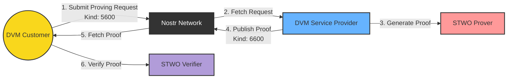

# ASKELADD Marketplace
## Architecture



Typical flow:

1. User submits a proving request to the network (DVM Job Kind `5600`)
2. A DVM Service Provider picks the request and generates a proof using the STWO prover.
3. The proof is published to the Nostr network (DVM Job Result Kind `6600`).
4. The DVM Customer can verify the proof using the STWO verifier.


## User request: JOB EVENT KIND 5600 

Request sent by user: 

```rust

    #[derive(Debug, Serialize, Deserialize, Clone)]
    pub struct GenerateZKPJobRequest {
        pub request: serde_json::Value,
        pub program: Option<ProgramParams>,
    }

    #[derive(Debug, Serialize, Deserialize, Clone)]
    pub enum ContractUploadType {
        InternalAskeladd,
        Url,
        BackendEndpoint,
        Ipfs,
    }

    #[derive(Debug, Serialize, Deserialize, Clone)]
    pub struct ProgramParams {
         pub event_id: Option<EventId>,
        pub unique_id: Option<String>,
        pub pubkey_application:Option<String>, // Use for one to one marketplace => difficult on the archi of the DVM
        pub inputs: HashMap<String, String>,
        pub inputs_types:Option<HashMap<String, String>>,
        pub inputs_encrypted:Option<HashMap<String, String>>,
        pub contract_reached: ContractUploadType,
        pub contract_name: Option<String>,
        pub internal_contract_name: Option<ProgramInternalContractName>,

        // For External program
        // pub endpoint:Option<String>
    }

    // Only used by ASKELADD Program
    #[derive(Serialize, Deserialize, Debug, Clone)]
    pub enum ProgramInternalContractName {
        FibonnacciProvingRequest,
        PoseidonProvingRequest,
        WideFibonnaciProvingRequest,
        MultiFibonnaciProvingRequest,
        Custom(String),
    }


```


## Business: JOB Result 6600 DVM


```rust

   #[derive(Debug, Serialize, Deserialize)]
    pub struct GenerateZKPJobResult {
        pub job_id: String,
        pub response: serde_json::Value,
        pub proof: StarkProof,
    }


```
